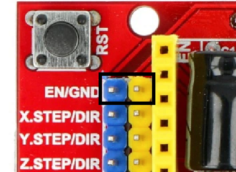
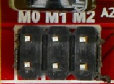
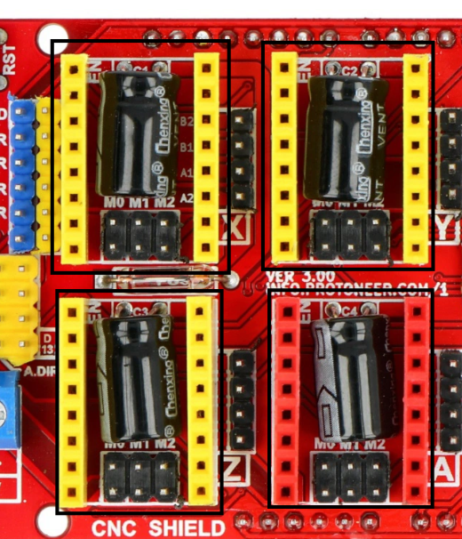
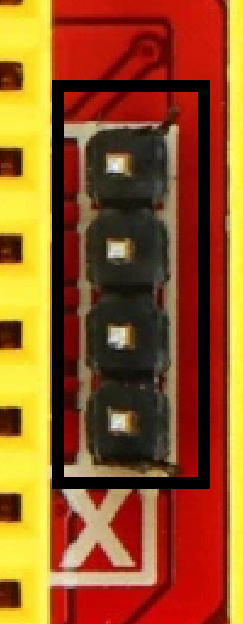
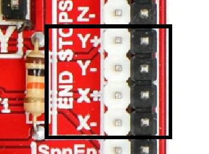
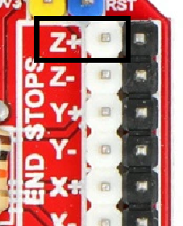
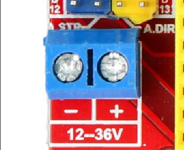

## This is how to wire the machine to the CNC shield.

1. Attach the CNC shield on top of the arduino.
2. Enable the board by placing a jumper on those two pins.

   

4. Place jumpers on the micro step resolution for each driver, I'm using a DRV8825 driver and I'll select M1. I consulted the table I found inside this document on page 8: https://bulkman3d.com/wp-content/uploads/2019/04/CNC-Shield-Guide-BM-v1.0.pdf
 
  

5. Place the stepper drivers in their designated places.

   

6. Connect the stepper motors to the pins next to the drivers, the orientation isn't important since it can be configured in the software if the motor is spinning the wrong way.

   

7. Connect the limit switches.

   

8. Connect the laser. The laser should have the pins labeled on the PCB. The 12V + and - wires should go to the PSU or the 12V screws terminal on the CNC shield. The third wire which carries the PWM signal goes to the Z+ or Z- limit switch pin.

   

9. Connect the PSU.

    

The best way I've seen to keep the laser wires sturdy and outside the workspace, yet still able to move freely, is to zip tie them to a piece of filament.
